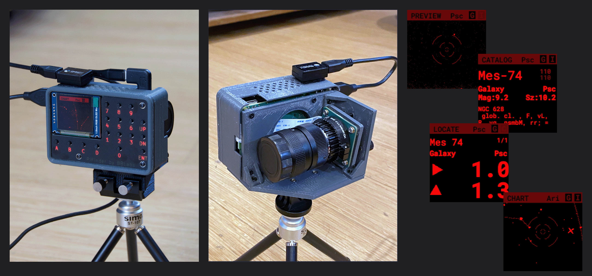

# PiFinder
A plate solving telescope finder based around a Raspberry PI, RPI HQ Camera, and custom UI 'hat'

For an overview of what the PiFinder is and how it came to be visit the official project website at [PiFinder.io](https://www.pifinder.io/build-yours) 

The PiFinder is my attempt to improve my time at my telescope.  I don't get nearly enough of it and I want to enjoy it as much as possible.  So after years of observing with paper charts and, later, a Nexus DSC here is what I felt I was missing:
* **Reliable telescope positioning:**  The Nexus DSC is great, but my scope just isn't built for solid encoder integration.  The slop in the way I have to couple the encoders means poor pointing accuracy.
* **Easy setup:**  The Nexus DSC needs multi-star alignment to understand how the encoders map to the sky.  The process is not terrible, but I'd like to avoid it.
* **Good push-to functionality**:  This is one place the Nexus DSC shines... if it's well aligned.  The catalog system is okay, and once you select and object the screen is clear and helpful to get the telescope pointed correctly.
* **Observation logging**:  I like to keep track of what I see each night.  I don't often sketch, just record what I saw when, with what eyepiece and some basic info about the experience.  If I could do this right at the eyepiece, that'd save time.

My hope is that other people will find this combination of functionality useful, will build their own PiFinder and help the whole project improve by making suggestions and potentially contributing to the software.  It's a pretty easy build with off the shelf parts and beginner friendly soldering.  

## Features
* Zero setup: Just turn it on and point it at the sky!  
* Accurate pointing: Onboard GPS determines location and time while the camera determines where the scope is pointing.  Inertial Measurement Unit tracks scope motion and updates sky position between camera solves
* Self-contained:  Includes catalog search/filtering, sky/object charting, push-to guidance and logging all via the screen and keypad on the unit.
* Dark site friendly:  Red OLED screen and soft backlit keys have wide brightness adjustment, right down to 'off'. No need for bright cell phones or tablets
* Easy access: Can be mounted by the eyepiece just like a finder.
- Wifi Access Point / SkySafari Integration:  The PiFinder can act as a WIFI access point to connect your tablet or phone to sync SkySafari or other planetarium software with your scope.

## Build Your Own
The PiFinder is fully open-source hardware and software.  You can order PCB's and 3d print the case with the files in this repo and order all the parts from the [parts List](https://pifinder.readthedocs.io/en/release/BOM.html).

If you would like pre-assembled units, kits or other items to jump start your PiFinder journey, visit [PiFinder.io](https://www.pifinder.io/build-pifinder) to see what's available and place an order.

## Docs

* [User Manual](https://pifinder.readthedocs.io/en/release/user_guide.html)
* [Parts List](https://pifinder.readthedocs.io/en/release/BOM.html)
* [Build Guide](https://pifinder.readthedocs.io/en/release/build_guide.html)
* [Software Setup](https://pifinder.readthedocs.io/en/release/software.html)
* [Developer Guide](https://pifinder.readthedocs.io/en/release/dev_guide.html)

## Releases and Updates

If you are using a PiFinder, I recommend you watch releases in this repo.  Click the 'Watch' button up at the top right of the page, choose 'Custom' and then 'Releases' to make sure you don't miss any new features!

If you'd like to learn more about how it works, and potentially build your own, everything you need should be here.  I recommend starting with the [User Manual](https://pifinder.readthedocs.io/en/release/user_guide.html) and then checking out the build process using the links below.

## Discord
Join the  [PiFinder Discord server](https://discord.gg/Nk5fHcAtWD) for support with your build, usage questions, and suggestions for improvement.

<a href='https://ko-fi.com/brickbots' target='_blank'>
