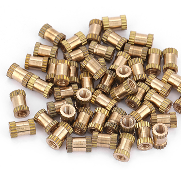
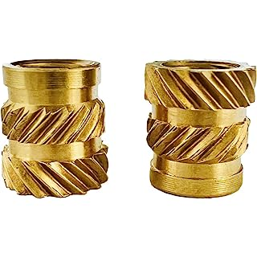

# PiFinder Case Parts Readme 

In this directory you'll find STL's for all the parts of the PiFinder.  There are a few options for some pieces, so please read through this document before starting your prints.   Reach out to [info@pifinder.io](mailto:info@pifinder.io) or join our [Discord](https://discord.gg/Nk5fHcAtWD) to ask any questions.

## Mount variations
The `mount` subfolder contains dovetail mounts designed with various angles to orient the PiFinder for easy use.  Depending on where you have your finder shoe mounted on your scope, select the closest available angle.  It doesn't need to be perfect, the angle is mainly to have the screen/keypad conveniently angled.  The PiFinder should work fine if it's not entirely upright.  Please see the image below for angle examples/explanation.

## Insert Size
The build uses m2.5 threaded inserts, but there are two main types of these in general availability.  To support both of these types, there are two versions of all the pieces that require inserts.  These are stored in a `small_inserts` and `large_inserts` folder and you should only need one set.

See the images below to identify the type of insert you have.  They accept the same type of screw, but the outside diameters are slightly different.

#### Small Inserts

#### Large Inserts

## PiSugar

For builds using the PiSugar battery pack, the camera needs to mount a bit further outward.  To accomplish this, use the `back_ps` piece in the subdirectory for your inserts.  If you are using some other method to power your PiFinder, use the `back` piece to save a couple of MM of width and some printing time.

