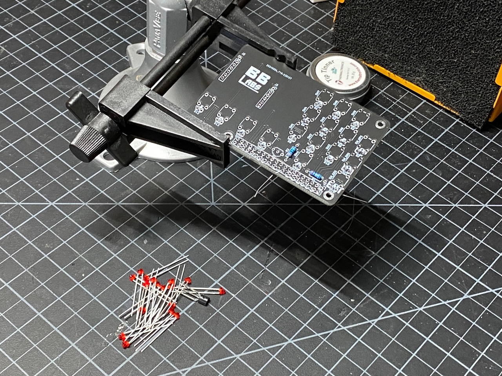
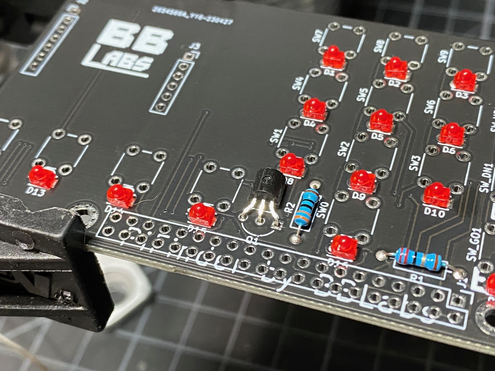
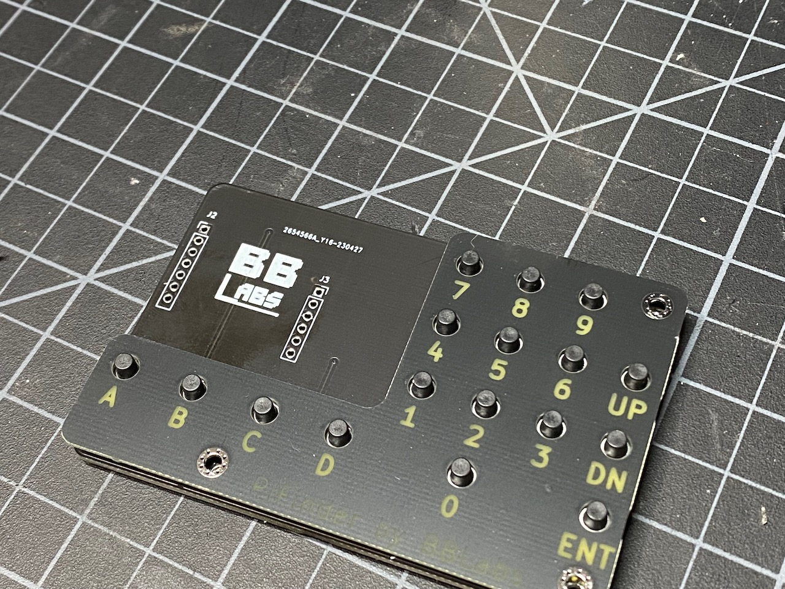
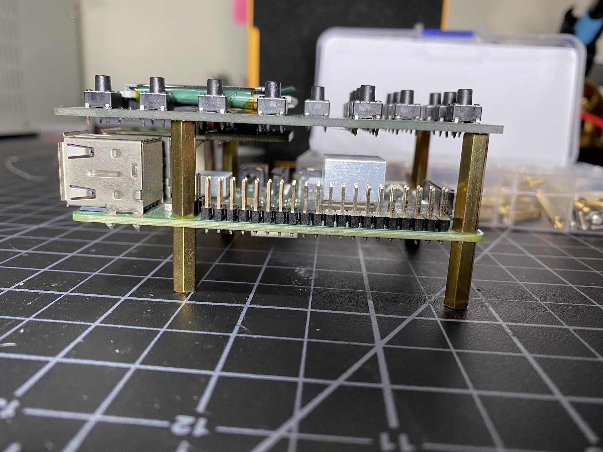
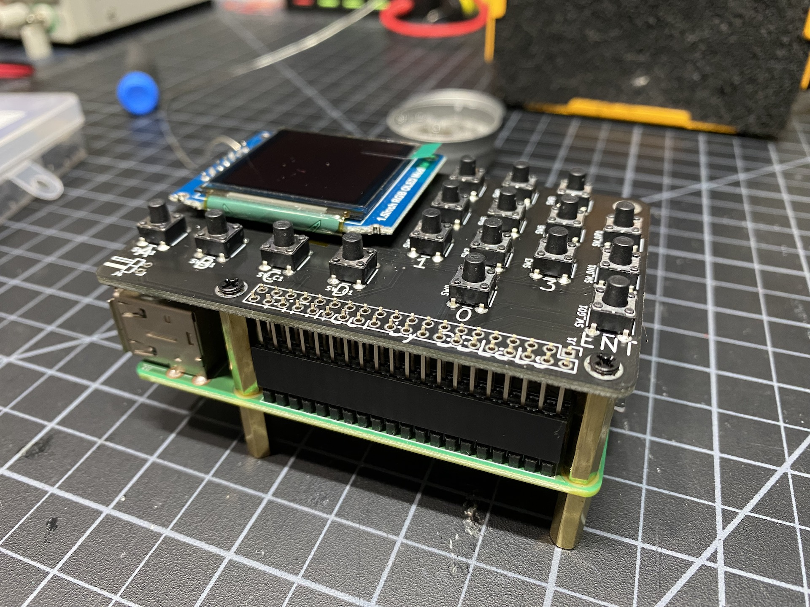

# Build Guide - UI Board

- [Introduction and Overview](build_guide.md)
- [UI Board](build_guide_ui.md)
- [Part Printing and Prep](build_guide_parts.md)
- [Assembly](build_guide_assembly.md)

## PiFinder UI Hat
A key part of the PiFinder is a custom 'Hat' which matches the general form factor of the Raspberry Pi and connects to it's GPIO header.  It contains the switches, screen and Inertial Measurement Unit along with keypad backlight components

It's all through-hole components, so should be approachable to even beginners... but the component build order is important as some items block access to others.

There are still some older photos here from the v1 non-backlit board, but the assembly is the same once the backlight components are in place.

### Backlight Components
The two resistors are an easy place to start.  R2 is the vertical oriented 330ohm part and R1 is the 22ohm oriented horizontally.  Direction does not matter with these, just make sure they sit flat and trim the leads on the back when they are soldered.

The LED's are the next lowest components, so they go next.  Polarity matters here, so mind the direction.  The longer lead of the LED should go through the round hole in the footprint.  The photo below shows the orientation

Take you time and make sure each is positioned well.  They should be pretty uniform, but little inconsistencies don't matter too much.  I like to place them all in the board, turn it upright and solder one leg of each.  Then I go back and press on each LED as I reheat the one soldered leg to make sure it's sitting flat and even-ish.

Once I've verified they all look okay, I'll solder the other leg and trim all the leads.

The final component for the keypad backlight is the drive transistor.  It's located right by R2 and the GPIO connector.  When inserting the part, the flat side of the package should line up with the flat side of the silkscreen.  Once it's inserted fold the flat side of the transistor agains the PCB so it will be clear of the keypad cover PCB

You can see the position/orientation in the image below.  Once you've got it situated, solder it in and clip the leads.

### Switches
Switches are easy and can go next.  Place each one on a footprint and press it down fully.  Once they are all inserted, before you start soldering visually inspect them for any that are tilted.  

It's also a good idea to place the top legend plate over them to make sure they all clear the holes properly.  Then solder them up!

### IMU
The Inertial Measurement unit is next.  The IMU has an annoyingly bright green LED on it, which you will probably want to paint over with a drop of black nail polish.  It can be done after it's soldered, but it's much easier before hand.  See the image below to ID the offending component.

The photo below shows the orientation on the back of the PCB.  Solder the headers into the PCB first, then orient the IMU, make sure it sits flat and square with the board.  It does not need to be perfect, but should be secure and low-profile. Solder it into position then trim back the leads of the header to help make sure they don't touch the Raspberry Pi later.

### Display
The display comes next and will cover the solder points for the IMU header, so double check your solder joints there before proceeding!

You'll need to remove the stand-offs by unscrewing them from the front.  

Next you'll need to remove the plug from the underside of the board.  This is not absolutely necessary, but will help the display sit lower and flatter.  Use a sharp pair of cutters to cut each of the leads to the connector first.  Cut down low, but the exact location is not critical.  Once this is done, you can use clippers to cut away the plastic at the attachment points on both of the short sides.

It's a good idea to trim and insulate the IMU header pins.  There should be clearance, but it's easy to do and will avoid potential problems later.

To make the top plate fit a bit better and look tidier, I suggest sanding back or simply cutting the bottom tabs on the display PCB.  There is no circuitry there, they are just providing screw points which are not needed.

Test fit the screen with the header installed and the top-plate.  Everything should fit nicely and be square.  It's nice to face the longer pins of the header down for a cleaner look up top.

Remove the screen, turn over the board and solder the header into place

Trim these leads back when done.  Then flip the board back over, place the screen and solder it in.  Take your time and make sure it's nice and lined up for a clean look.

### Connector
Attaching the GPIO connector is the last soldered bit for the Hat.  To get this properly spaced, you'll need to mount the PCB to your Pi using the stand-off's you'll be using for final assembly.  

The pins on the connector are long to accommodate various spacings.  Plug the connector firmly into your Pi and once you have mounted the PiFinder hat to your Pi with stand-offs/screws you'll be able to solder the connector with the correct spacing.

Make sure you've added any heatsinks you plan to use.  In these photos, I'm using a RP3 for assembly and I know what spacing I need.  Take your time here and make sure the hat is secured properly to the Pi, that there is no mechanical interference, and that you're satisfied with the spacing before soldering the connector.  

Depending on your heatsink, you may need a more complicated stand-off arrangement.  You want the hat to completely clear the Pi, but be as low-profile as possible after than.  

Check the photos below for the procedure, it's easier than it sounds!

There you go!  The PiFinder hat is fully assembled and you can move on to the [assembly](build_guide_assembly.md) of the rest of the unit.

