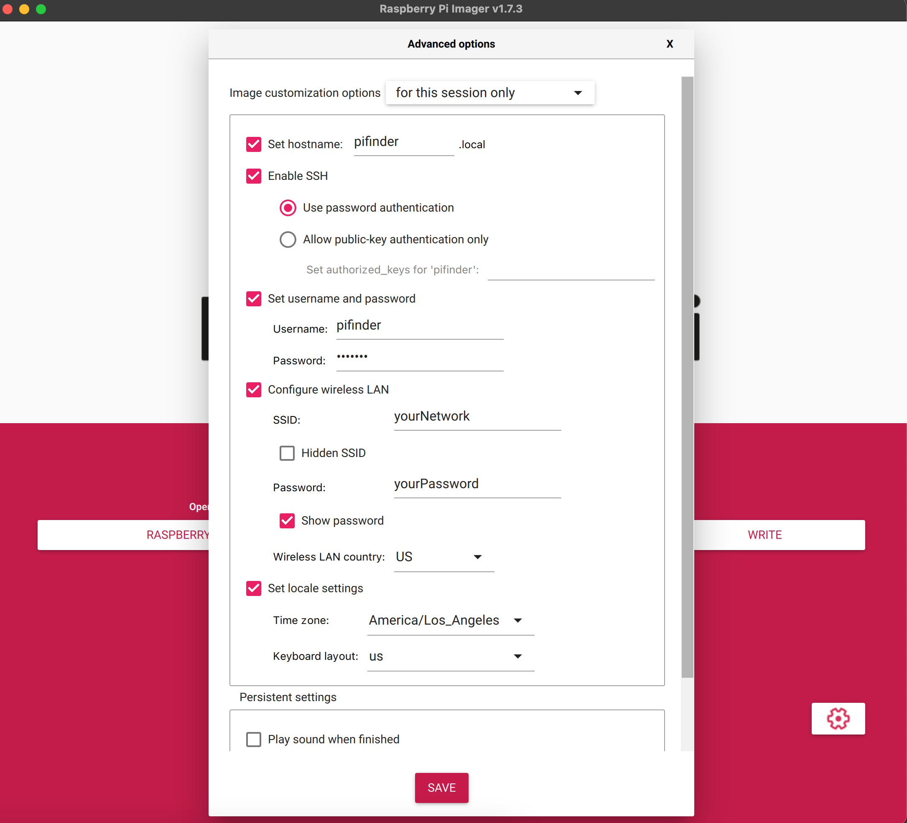

# Software Setup

Once you've built or otherwise obtained a PiFinder, here's how to setup a fresh SD card to run it.  You can do this completely headless (no monitor / keyboard) if desired.

## General Pi Setup
* Create Image:  I'd strongly recommend using the Rapsberry Pi imager.  It's available for most platforms and lets you easily setup wifi and SSH for your new image.
	* Select the 64-Bit version of Pi OS Lite (No Desktop Environment)
	* Setup SSH / Wifi / User and Host name using the gear icon.  Below is a screengrab showing the suggested settings.  The username must be pifinder, but the host name, password, network settings and locale should be customized for your needs.

* Once the image is burned to an SD card, insert it into the PiFinder and power it up.   It will probably take a few minutes to boot the first time.
* SSH into the Pifinder using `pifinder@pifinder.local` and the password you  setup.
* Update all packages.  This is not strictly required, but is a good practice.
	* `sudo apt update`
	* `sudo apt upgrade`
 * Enable SPI / I2C.  The screen and IMU use these to communicate.  
	 * run `sudo raspi-config`
	 * Select 3 - Interface Options
	 * Then I4 - SPI  and choose Enable
	 * Then I5 - I2C  and choose Enable

Great!  You have a nice fresh install of Raspberry Pi OS ready to go.  The rest of the setup is completed by running the `pifinder_setup.sh` script in this repo.  Here's the command to download and run the script in one step:

 `wget -O - https://raw.githubusercontent.com/brickbots/PiFinder/main/pifinder_setup.sh | bash`

The script:
* Clone this repo
* Install the needed packages/dependencies
* Download some required astronomy data files
* Setup Wifi access point capabilities
* Create a samba share for pulling images, and observations logs and adding observing lists
* Finally, setup the PiFinder service to start on reboot.

Once the script is done, reboot the PiFinder:
`sudo shutdown -r now`

It will take up to two minutes to boot, but you should see the startup screen before too long:
