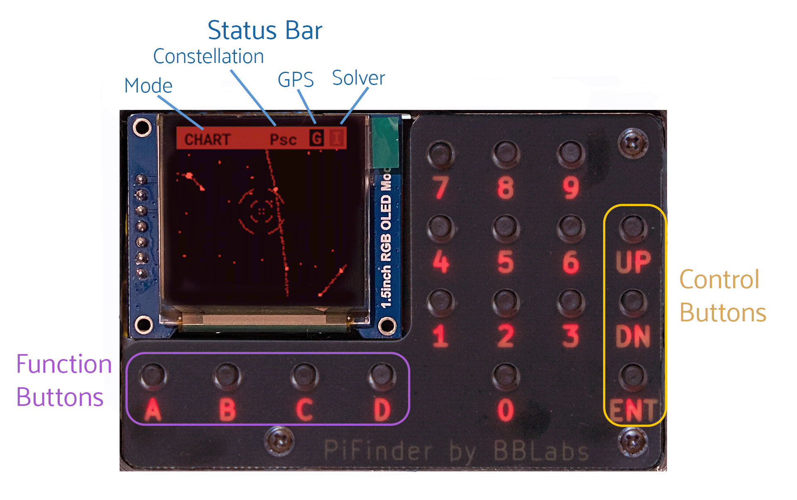
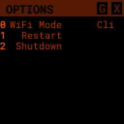
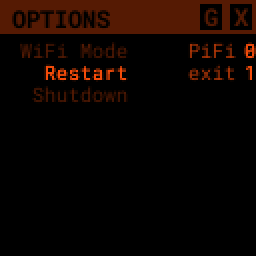
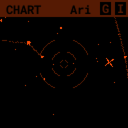
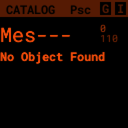
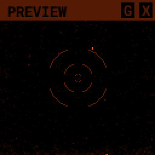
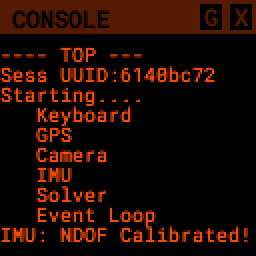

# PiFinder User Manual

- [Introduction and Overview](#introduction-and-overview)
- [Hardware](#hardware)
  * [Overview](#overview) 
  * [Mounting](#mounting) 
  * [Camera Setup](#camera-setup) 
  * [Camera Alignment](#camera-alignment) 
- [UI Screens](#ui-screens)
  * [Options](#options)
  * [Chart](#chart)
  * [Catalog](#catalog)
  * [Locate](#locate)
* [System Screens](#system-screens)
  * [Log](#log)
  * [Preview](#preview)
  * [Status](#status)
    * [System Options](#system-options)
  * [Console](#console)
- [How-To](#how-to)
  * [First Time Setup](#first-time-setup)
  * [WiFi](#wifi)
  * [SkySafari](#skysafari)
  * [Data Access (SMB Share)](#data-access)
  * [Shutdown and Restart](#shutdown-and-Restart)
  * [Observing lists](#observing-lists)
- [FAQ](#faq)

## Introduction and Overview
Thanks for your interest in the PiFinder!  This guide describes how to use a PiFinder but if you want information on building one, please see the [Build Guide](./build_guide.md) and the [Bill of Materials](BOM.md).

The PiFinder is a self-contained telescope positioning device.  It will let you know where your telescope is pointed, provide the ability to choose a particular target (like a Galaxy or other DSO) and direct you on how to move your telescope to find that object.  There are some other nice features along with these core functions, but the PiFinder is designed primarily as a way to get interesting objects into your eyepiece so you can take a look at them.

The primary way PiFinder determines where your telescope is pointing is by taking photos of the sky and using stars contained therein to determine where it's pointing.  Having the camera of the PiFinder 

## Hardware
You probably build the PiFinder you are going to use, but if not, here's a quick overview of the unit. 

### Overview
One side has the keypad and screen, while the other has the camera, lens and camera mounting cell.  There is likely also a GPS transciever plugged into one of the USB ports with an antenna mounted on top.  

Depending on how your unit was built it may have internal batteries or it may be powered from your telescope through the available USB-C port.

In the photo on the left above, you can see two of the three thumbscrews used to tilt the camera mounting cell.  These thumbscrews allow alignment of the camera with your telescope optical axis after it's mounted.

### Mounting
Depending on the mounting system you printed or received for your PiFinder, you will either have a rail on the bottom which fits a standard finder shoe, or a Go-Pro style mount.  As with any finder, a sturdy and stable mounting method is needed; Ideally with the ability to take off the finder and re-attach it while retaining it's relationship with the telescope.

### Camera Setup
After you mount your PiFinder the first time, you'll need to setup the camera aperture and focus.
If you are using the recommended lens, it will have two adjustment rings on it; One to adjust the aperture (f-stop) and one for focus.

#### F-Stop
Make sure the aperture of your lens is all the way open.  For the recommend lens, turn the f-stop ring towards you all the way if you are looking at the unit like like the image above.

#### Focus
Focus for plate solving is actually not all the critical, and defocusing a bit can even improve the solve as it spreads star light across multiple pixels.  You can either use a very distant object during the day, or a bright star at night.  

There is a focus helper in the [Preview](#preview) options to help.  This will show a zoomed in image from the center of the camera view to help you hit focus on the small screen.
To activate the focus helper, hold down the 'A' function key while in preview mode and turn on the option from the settings menu.  As you adjust the focus ring, you'll have to wait a second or two make after each adjustment to see the results in the exposure.

### Camera alignment
Once your PiFinder is mounted to your telescope, you'll need to align it with the optical axis of your telescope just like a RACI or red-dot finder.   To do this, you can use the three thumbscrews at the back of the unit to adjust where the camera is pointing:

* To start, point your telescope at a distant object or bright star and center it in your telescope eyepiece.  
* Turn on the PiFinder if it's not on already
* Make sure your PiFinder is in [Preview](#preview) mode so you can see what the camera sees.
  * If you are doing this during the day, you'll need to use the _DN_ key to reduce the exposure
* Use the three thumbscrews to adjust the tilt of the camera.  Between each adjustment, make sure you wait for a new exposure to be taken to see the results.  This normally takes about 1.5 seconds (at night), depending on your exposure settings.
* If the PiFinder is not holding alignment between observing sessions, try tightening the middle screw, or selecting a stronger spring, to help hold the cell more tightly against the thumbscrews. 

### Keypad and Screen
The main way you'll interact with the PiFinder is through the Keypad and Screen located on the front.  Ideally this will be mounted near your eyepiece for easy access. 

Along with the 1.5" oled screen, the keypad has three primary parts, a numeric keypad (_0-9_), four functions keys (_A, B, C, D_), and three control keys (_UP, DN, ENT_).  The screen will display different content depending on the mode you are in, but there will always be a Status Bar along the top which displays which mode the UI is in, the current constellation being pointed at (if a solve has been completed), GPS and Solver Status.

- If the GPS has locked and provided a location, the GPS square in the status bar will be filled in and the G will be in black.  
- The solver status will show either C (Camera) or I (IMU) depending on the source of the last position fix.  The background of this square fades from red to black, over six seconds, indicating the time since last solve.  

## UI Screens
The user interface for the PiFinder is split into various screens that you can switch between to perform different tasks.  The A key is used to cycle between the three main screens:

* Chart
* Catalog
* Locate

By holding down the Enter key and pressing the A function key you can get to the less commonly used screens:

* Console
* Status
* Camera Preview

Some actions in one screen will move you to another, for instance selecting an object from the Catalog will switch automatically to the Locate screen.  

The remaining function keys serve different purposes depending on which screen you are on at the time you press them, but there are some key-combinations that act across any of the individual screens:

* Long press _A_:  For screens with options, such a the Catalog screeen, holding down the _A_ function key will bring up the options for that screen.  See [Options](#options) below.
* _ENT + UP/DN_: This combination will adjust the screen brightness up and down at any time.

### Options
Many screens have options which change the way they behave or perform other less commonly used actions.  Pressing and holding the _A_ button will bring up the options for whichever screen you are currently using.  To exit the option screen press _A_ to return to the previous screen.

The options screen will show one option or action item per line with the name or description of the item to the left and the current value to the right.  The bright numbers along the left edge indicate the key on the keypad to press to access that item.

Once an item is selected the item will be highlighted and the available values or types of actions will be listed along the right hand side.   The bright numbers along the right hand side will let you select the value(s) for this item.

Some types of options can only have a single value, like Magnitude above.  Others, such as Obj Types will allow you to select multiple values.  If an option only has a single value, selecting it will return you to the main options page.  For options that can have multiple values, you'll need to use the _ENT_ key to confirm your selections and return to the main option page.

The Options screen can also contain less commonly used actions which will take place when a value is selected.  

The Options screen shown above (for the Status screen) has general PiFinder options along with a couple actions.  Selecting an action item, such as _1_, will always have one additional step to confirm the action, or allow you exit.

To exit the option screen press _A_ to return to the previous screen.

### Chart

The chart screen will display a star chart centered around the current RA / Dec coordinates the PiFinder has determined.  By default it shows stars down to magnitude 7 and has a 10 degree field of view.  As you move your telescope the chart will be updated several times a second using either a plate solve for a captured image or an approximation based on the last plate solve and the Inertial Measurement Unit (IMU).

There is a Telrad style reticle that can be used to help orient the chart.  The outer ring is four degrees in diameter, the inner two degrees and the middle 1/2 degree.

If you have a target selected, an arrow around the outer rim of the reticle will point in the direction that target is located. 

 

If the target is within the current chart, the arrow will disappear and a small X will mark the spot of the target.  

While viewing the chart you can adjust it's appearance and FOV in several ways:

* _B_ Function key: Toggle reticle state.  There are several brightness levels including off.
* _C_ Function key: Toggle constellation line brightness.
* _D_ Function key: Toggle observing list marker brightness.  This will show markers for DSO objects in your observing list.
* _UP/DN_ :  Increase or decrees the field of view (zoom).  This ranges from 5 degrees to 60 degrees.
* Holding the _A_ function key will bring up settings for the chart including the above reticle/constellation brightness

### Catalog

The catalog screen allows the searching and selection of astronomical objects to locate.  It has multiple catalogs available (Messier, NGC, IC) and displays some basic information about each object.  You can set filter criteria (Altitude, Magnitude, Object Type) to limit the objects surfaced via the search.

The _C_ function keys will cycle through the various catalogs available.  The upper-left will show the count of filtered objects over the total number of objects in each catalog.

Use the number keys to enter the id of the object you are looking for.  As you type, any matching object will be displayed.  Typing in _74_ to look for Messier 74 will bring up Messier 7 and 74 in turn as you enter numbers.

 

If the number you have entered matches an object in the catalog, information about the object will be displayed below including:
* Object Type
* Constellation
* Magnitude
* Size
* Other names
* IC/NGC coded observing notes

Use the _D_ key to clear the number field out and start fresh.  If you find an object you are interested in, pressing the _ENT_ key will add it to your target list and switch to the [Locate](#Locate) screen.

Holding the _A_ key for two seconds will bring up the settings for the catalog.  You can filter by apparent altitude, magnitude and object type.  The Options page also has an action to push the currently filtered catalog to the [Observing](#observing-lists) list. Pressing _A_ will bring you back to the catalog and update the count of objects that match your filter.

* The _UP/DN_ keys will scroll through the currently filtered objects.

### Locate

The Locate screen uses the last solve and currently selected target to provide a visual indication of which direction to move your telescope in order to center the target.  It also provides a summary of the current target and information about the overall target list.  

Values are expressed in degrees with the top line being rotation in Azimuth and the bottom line in Altitude.  

* _UP/DN_ will cycle through the active list.  The numbers in the upper-right corner of the screen represent the index of the current object / total number of objects in the list and the list name is displayed directly below.
* _ENT_ will switch back to the catalog screen to access full information about the current target
* _B_ will toggle between the [History and Observing lists](#observing-lists)

The currently target is also displayed on the [Chart](#Chart) screen as a small tick mark.

## System Screens
The screens listed below are more rarely used and do not show up when rotating through the regular UI screens using the _A_ key.  To access these screens, rotate through them using the _ENT-A_ combination.  

### Log

The Log screen can be accessed at any time by long holding the ENT key.  It allows you to record your observation of the currently selected target in a database as part of a session.  Each session starts when you power-up, or reset, the PiFinder and every observation logged during the session will be grouped together for later review.

Summary information about the current target is displayed along with the distance from the current telescope position.  This distance allows you to make sure you are observing/logging the correct object in a crowded field, like Virgo.  

You can add some details about your observation by holding down the A key to add notes.

* Transp. :  The transparency of the sky.  This is often noted along with Seeing below
* Seeing:  The stillness of the atmosphere. 
* Eyepiece:  You can note which of your eyepieces you are using.
* Obsabillit:  Observability - How easy is it to spot and recognize this object
* Appeal: Overall rating of this object.. would you refer a friend?

Pressing the A key from the Observing Notes options will bring you back to the Log screen.

* B key - Logs the current target to the database and saves a 512x512 snapshot image with current exposure settings.
* C key - Logs the current target to the database and takes a high-resolution photo.  Takes longer, but you get a nice image of a 10 degree patch of sky that should have contained your target.
* D key - Abort and return to the previous screen

### Preview

The preview screen displays most recently taken exposure from the camera.  You can adjust the processing of this image (just for display purposes), adjust exposure and zoom in to focus.

* _B_ key - Adjust reticle brightness or turn it off completely
* _C_ key - Turn background subtraction on/off
* _D_ key - Adjust gamma correction intensity

In the options menu (long-press _A_) you can adjust these same display parameters and also enter Focus Help mode.  In this mode the camera image is enlarged to help achieve good focus on a star.  Since this only shows the center of frame, get a star lined up in the reticle before activating Focus Help.

You can adjust overall exposure using the _UP/DN_ keys (check the [Console](#console) for specific setting).  If you'd like to save this exposure as the default for future sessions, use the _ENT_ key.

### Status

The status screen displays:
* LST SLV: Seconds since last position solution, plus last position solution source (CAM or IMU)
* RA/DEC: Last solved Right Ascension and Declination
* AZ/ALT: Last solved position in Azimuth / Altitude.  This can only be displayed if a GPS lock is achieved to provide location and time information.
* GPS: GPS Status (Locked/--)
* IMU: Inertial Measurement Unit status.  Moving/Static + Confidence level (0-3)
* IMU PS:  Current IMU position (Azimuth / Altitude) before conversion to astronomical AZ/ALT position.
* LCL TM: Local time (requires GPS fix)
* UTC TM: UTC Time (requires GPS fix)
* CPU TMP: Temperature of the Raspberry PI CPU
* WiFi: Current WiFi mode, either AP for access point, or Cli for client
* IP: Current IP address for connecting to via software such as SSH or SkySafari

#### System Options
The [Options](#options) page for the status screen gives access to general PiFinder options and actions.  Press and hold the _A_ key to access the option page.
* Change [WiFi](#wifi) Mode between client and access point
* [Restart](#shutdown-and-restart) the PiFinder software
* [Shutdown](#shutdown-and-restart) the PiFinder

### Console

Logged information from the various parts of the PiFinder system is displayed here.
* _UP/DN_ key - Scroll the log display

## How-To

### First Time Setup

Here's a quick start guide for your first time operating the PiFinder:
* Mount the PiFinder to your scope and power it on.  See the [Mount and Power](./build_guide.md) section of the build guide
* Once the PiFinder has booted and you looking at the preview
	* Set exposure if needed and Focus your lens. See the [Preview](#preview) screen for details on setting exposure and zooming in to check focus
	* Use a star or distant object to align the PiFinder with your telescope
* If it's night-time, and you've got somewhere close for exposure and focus, the PiFinder should have already started solving.  If not:
	* Adjust exposure to make sure you see some stars in the preview display.  If the exposure is too long, relative brightness between stars will be lost and this can also prohibit solving.  
	* Focus is somewhat less critical, but being too far out of focus will reduce the number of faint stars available for solving.
* If you are in an open area, the GPS dongle should have achieved a lock.  Check  the status indicator in the title bar, or the [Status](#status) screen to verify.  If not, double check the status light on the dongle and make sure it has an unobstructed view of as much sky as possible.  The first solve after being off for a few days needs more satellites and will take longer.  Subsequent locks will be much quicker using some cached data in the dongle.

### Switch Sides
By default, the PiFinder software is set for right-side focuser operation.   To switch to left-side orientation, use the [Options](#options) page of the [Status](#status) screen.  This will make sure the preview is displayed correct side up and the IMU up/down direction is correct.

### WiFi
The PiFinder can either connect to an existing network, or serve as an wireless access point for other devices to connect to.  Use the [Options](#system-options) page of the Status screen to switch between these two modes and see which mode is currently active.

Using the PiFinder in Access Point mode creates a network called AP_PiFinder with no password to allow easy connection of phones, tablets and other devices in the field.

In most cases, you can use the name `pifinder.local` to connect to the PiFinder.  On older computer or those that don't support zeroconf networking, you can use the IP address provides on the [Status](#status) screen to connect.  You can connect to the PiFinder via:
* SSH to get shell access for software updates and other admin tasks
* SMB (Samba) to access saved images, logs an observing lists
* LX200 protocol to allow updating of a planetarium app, such as [SkySafari](#skysafari), with the position of the telescope

### SkySafari
The PiFinder can provide real-time pointing information to a device running SkySafari via the LX200 protocol.  See this [guide](./skysafari.md) for complete details, but here is the connection info:
* Use 'Other' telescope type
* Mount Type: Alt-Az, GoTo.. even if your scope is Push-To.  This allows sending of targets from SkySafari to the PiFinder
* Scope Type: Meade LX200 classic
* IP Address: `pifinder.local` or IP address provides on the [Status](#status) screen.
* Port: 4030

### Data Access
In the course of using the PiFinder several data files are created that may be of interest.  These are available via a SMB (samba) network share called `//pifinder.local/shared`.  Accessing this will depend on your OS, but the PiFinder should be visible in a network browser provided.  There is no password requirement, just connect as `guest` with no password provided.

Once connected, you'll see:
* `captures/`: These are images saved when logging objects.  They are named with the observation ID from the database.
* `obslists/`: This folder holds observing saved during a PiFinder session or to load for future sessions.
* `screenshots/`:  It's possible to take screenshots while using the PiFinder (hold down _ENT_ and press _0_).  They are stored here.
* `solver_debug_dumps/`: If enabled, information about solver performance is stored here as a collection of images and json files.
* `observations.db`: This is the SQLite database which holds all the logged observations.

### Shutdown and Restart

Although shutting down is not strictly needed before power-off, the PiFinder is a computer and there is a chance of file corruption.  Some MicroSD cards are more sensitive to this than others.

Shutdown and Restart actions are available from the [Options](#options) for the [Status](#status) screen.  Hold down _Ent_ and press _A_ to cycle through the system screens until you see the status screen, the press and hold _A_ to access the options.

Restarting the PiFinder software should not normally be needed, but can be useful for generating a new session id which is included for a photos and logging during a particular execution of the PiFinder software.

#### Observing lists
PiFinder maintains two lists of objects for each observing session; The History list and the Observing list.  

The History list will any object that you set as a target to push-to.  It's added to as soon as you press the _ENT_ key on the catalog screen to select an object.  The main purpose of the History list is to let you scroll back through objects you have observed that session.

The Observing list is a list of objects that is populated from either a filtered catalog or a file on disk.  It's a list of objects you'd like to observe during a session.  

Both these lists start empty at the beginning of each session.  To populate an observing list you can push a filtered list of objects from the [Catalog](#catalog) screen.

## FAQ

Have any questions?  Please send them through to me at [rich@brickbots.com](mailto:rich@brickbots.com) and I'll do my best to help and potentially add your question here.  Better yet, feel free to fork this repo and contribute via a pull request!