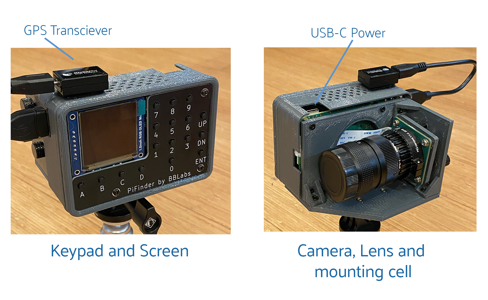
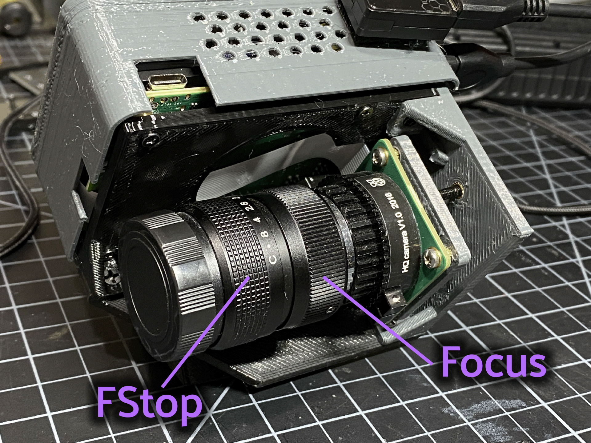
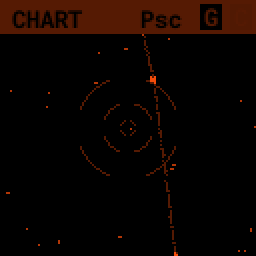

# PiFinder User Manual

- [Introduction and Overview](#introduction-and-overview)
- [Hardware](#hardware)
  * [Overview](#overview) 
  * [Mounting](#mounting) 
  * [Camera Setup](#camera-setup) 
  * [Camera Alignment](#camera-alignment) 
- [UI Overview](#ui-overview)
  * [Chart](#chart)
  * [Catalog](#catalog)
  * [Locate](#locate)
  * [Log](#log)
  * [Preview](#preview)
  * [Status](#status)
  * [Console](#console)
- [How-To](#how-to)
  * [Startup](#startup)
  * [Searching for objects](#searching-for-objects)
  * [Push-To object](#push-to-object)
  * [Observation logging](#observation-logging)
    + [Custom lists](#custom-lists)
- [FAQ](#faq)

## Introduction and Overview
Thanks for your interest in the PiFinder!  This guide describes how to use a PiFinder but if you want information on building one, please see the [Build Guide](./build_guide.md) and the [Bill of Materials](BOM.md).

The PiFinder is a self-contained telescope positioning device.  It will let you know where your telescope is pointed, provide the ability to choose a particular target (like a Galaxy or other DSO) and direct you on how to move your telescope to find that object.  There are some other nice features along with these core functions, but the PiFinder is designed primarily as a way to get interesting objects into your eyepiece so you can take a look at them.

The primary way PiFinder determines where your telescope is pointing is by taking photos of the sky and using stars contained therein to determine where it's pointing.  Having the camera of the PiFinder 

## Hardware
You probably build the PiFinder you are going to use, but if not, here's a quick overview of the unit. 

### Overview
One side has the keypad and screen, while the other has the camera, lens and camera mounting cell.  There is likely also a GPS transciever plugged into one of the USB ports with an antenna mounted on top.  

Depending on how your unit was built it may have internal batteries or it may be powered from your telescope through the available USB-C port.

In the photo on the left above, you can see two of the three thumbscrews used to tilt the camera mounting cell.  These thumbscrews allow alignment of the camera with your telescope optical axis after it's mounted.

### Mounting
Depending on the mounting system you printed or received for your PiFinder, you will either have a rail on the bottom which fits a standard finder shoe, or a Go-Pro style mount.  As with any finder, a sturdy and stable mounting method is needed; Ideally with the ability to take off the finder and re-attach it while retaining it's relationship with the telescope.

### Camera Setup
After you mount your PiFinder the first time, you'll need to setup the camera aperture and focus.
If you are using the recommended lens, it will have two adjustment rings on it; One to adjust the aperture (f-stop) and one for focus.

#### F-Stop
Make sure the aperture of your lens is all the way open.  For the recommend lens, turn the f-stop ring towards you all the way if you are looking at the unit like like the image above.

#### Focus
Focus for plate solving is actually not all the critical, and defocusing a bit can even improve the solve as it spreads star light across multiple pixels.  You can either use a very distant object during the day, or a bright star at night.  

There is a focus helper in the [Preview](#preview) options to help.  This will show a zoomed in image from the center of the camera view to help you hit focus on the small screen.
To activate the focus helper, hold down the 'A' function key while in preview mode and turn on the option from the settings menu.  As you adjust the focus ring, you'll have to wait a second or two make after each adjustment to see the results in the exposure.

### Camera alignment
Once your PiFinder is mounted to your telescope, you'll need to align it with the optical axis of your telescope just like a RACI or red-dot finder.   To do this, you can use the three thumbscrews at the back of the unit to adjust where the camera is pointing:

* To start, point your telescope at a distant object or bright star and center it in your telescope eyepiece.  
* Turn on the PiFinder if it's not on already
* Make sure your PiFinder is in [Preview](#preview) mode so you can see what the camera sees.
  * If you are doing this during the day, you'll need to use the Down control button to reduce the exposure
* Use the three thumbscrews to adjust the tilt of the camera.  Between each adjustment, make sure you wait for a new exposure to be taken to see the results.  This normally takes about 1.5 seconds (at night), depending on your exposure settings.
* If the PiFinder is not holding alignment between observing sessions, try tightening the middle screw, or selecting a stronger spring, to help hold the cell more tightly against the thumbscrews. 

### Keypad and Screen
The main way you'll interact with the PiFinder is through the Keypad and Screen located on the front.  Ideally this will be mounted near your eyepiece for easy access. 

Along with the 1.5" oled screen, the keypad has three primary parts, a numeric keypad (0-9), four functions buttons (A, B, C, D), and three control buttons (Up, Down, Enter).  The screen will display different content depending on the mode you are in, but there will always be a Status Bar along the top which displays which mode the UI is in, the current constellation being pointed at (if a solve has been completed), GPS and Solver Status.

- If the GPS has locked and provided a location, the GPS square in the status bar will be filled in and the G will be in black.  
- The solver status will show either C (Camera) or I (IMU) depending on the source of the last position fix.  The background of this square fades from red to black, over six seconds, indicating the time since last solve.  

## UI Overview
The user interface for the PiFinder is split into various screens that you can switch between to perform different tasks.  The A function button is used to cycle between the three main screens:

* Chart
* Catalog
* Locate

By holding down the Enter key and pressing the A function key you can get to the less commonly used screens:

* Console
* Status
* Camera Preview

Some actions in one screen will move you to another, for instance selecting an object from the Catalog will switch automatically to the Locate screen.  

The remaining buttons serve different purposes depending on which screen you are on at the time you press them, but there are some key-combinations that act across any of the individual screens:

* Long press A:  For screens with options, such a the Catalog screeen, holding down the A function key will bring up the configuration items for that screen.
* Enter + Up/Down: This combination will adjust the screen brightness up and down at any time.

### Chart

The chart screen will display a star chart centered around the current RA / Dec coordinates the PiFinder has determined.  By default it shows stars down to magnitude 7 and has a 10 degree field of view.  As you move your telescope the chart will be updated several times a second using either a plate solve for a captured image or an approximation based on the last plate solve and the Inertial Measurement Unit (IMU).

There is a Telrad style reticle that can be used to help orient the chart.  The outer ring is four degrees in diameter, the inner two degrees and the middle 1/2 degree.

If you have a target selected, an arrow around the outer rim of the reticle will point in the direction that target is located. 

 

If the target is within the current chart, the arrow will disappear and a small X will mark the spot of the target.  

While viewing the chart you can adjust it's appearance and FOV in several ways:

* B Function key: Toggle reticle state.  There are several brightness levels including off.
* C Function key: Toggle constellation line brightness.
* D Function key: Toggle observing list marker brightness.  This will show markers for DSO objects in your observing list.
* Up / Down:  Increase or decrees the field of view (zoom).  This ranges from 5 degrees to 60 degrees.
* Holding the 'A' function key will bring up settings for the chart including the above reticle/constellation brightness 

### Catalog

The catalog screen allows the searching and selection of astronomical objects to locate.  It has multiple catalogs available (Messier, NGC, IC) and displays some basic information about each object.  You can set filter criteria (Altitude, Magnitude, Object Type) to limit the objects surfaced via the search.

The 'C' function keys will cycle through the various catalogs available.  The upper-left will show the count of filtered objects over the total number of objects in each catalog.

Use the number keys to enter the id of the object you are looking for.  As you type, any matching object will be displayed.  Typing in 74 to look for Messier 74 will bring up Messier 7 and 74 in turn as you enter numbers.

 

If the number you have entered matches an object in the catalog, information about the object will be displayed below including:
* Object Type
* Constellation
* Magnitude
* Size
* Other names
* IC/NGC coded observing notes

Use the 'D' function to clear the number field out and start fresh.  If you find an object you are interested in, pressing the 'ENT' key will add it to your target list and switch to the [Locate](#Locate) module.

Holding the 'A' function key for two seconds will bring up the settings for the catalog.  You can filter by apparent altitude, magnitude and object type.  Pressing 'A' will bring you back to the catalog and update the count of objects that match your filter.

* The 'UP'/'DN' keys will scroll through the currently filtered objects.

### Locate

The Locate module uses the last solve and currently selected target to provide a visual indication of which direction to move your telescope in order to center the target.  It also provides a summary of the current target and information about the overall target list.  

Values are expressed in degrees with the top line being rotation in Azimuth and the bottom line in Altitude.  

* UP/DN will cycle through the target list.  The numbers in the upper-right corner of the screen represent the index of the current target / total number of targets in the list
* ENT will switch back to the catalog screen to access full information about the current target

The currently target is also displayed on the [Chart](#Chart) screen as a small tick mark.

### Log

The Log module can be accessed at any time by long holding the ENT button.  It allows you to record your observation of the currently selected target in a database as part of a session.  Each session starts when you power-up, or reset, the PiFinder and every observation logged during the session will be grouped together for later review.

Summary information about the current target is displayed along with the distance from the current telescope position.  This distance allows you to make sure you are observing/logging the correct object in a crowded field, like Virgo.  

You can add some details about your observation by holding down the A button to add notes.

* Transp. :  The transparency of the sky.  This is often noted along with Seeing below
* Seeing:  The stillness of the atmosphere. 
* Eyepiece:  You can note which of your eyepieces you are using.
* Obsabillit:  Observability - How easy is it to spot and recognize this object
* Appeal: Overall rating of this object.. would you refer a friend?

Pressing the A button from the Observing Notes options will bring you back to the Log screen.

* B button - Logs the current target to the database and saves a 512x512 snapshot image with current exposure settings.
* C button - Logs the current target to the database and takes a high-resolution photo.  Takes longer, but you get a nice image of a 10 degree patch of sky that should have contained your target.
* D button - Abort and return to the previous screen

### Preview
### Status
### Console

## How-To
### Startup
### Searching for objects
### Push-To object
### Observation logging
#### Custom lists

## FAQ
